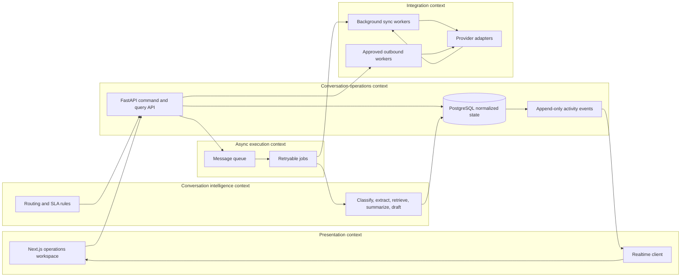
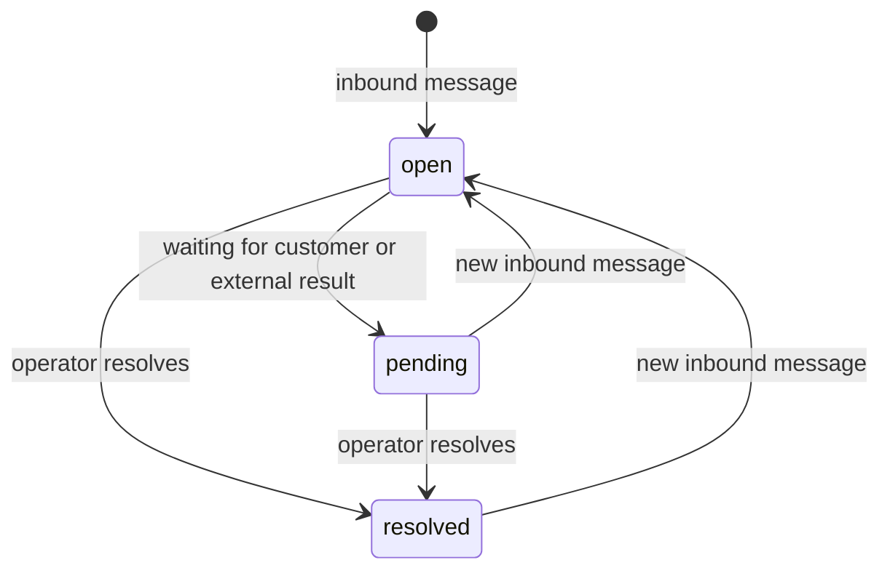
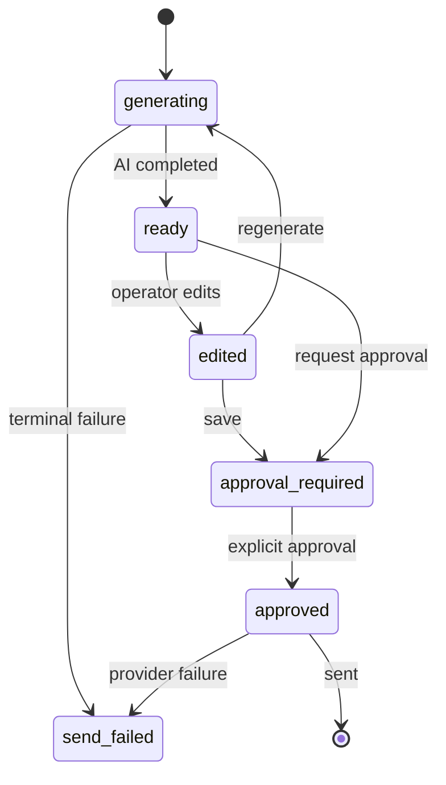
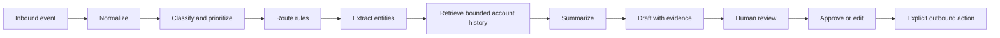
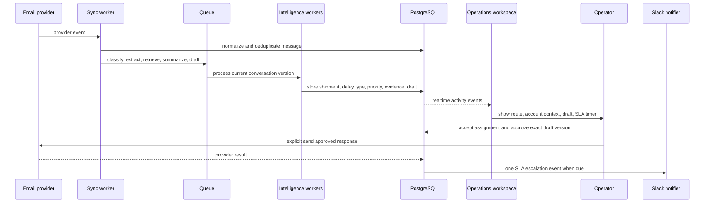
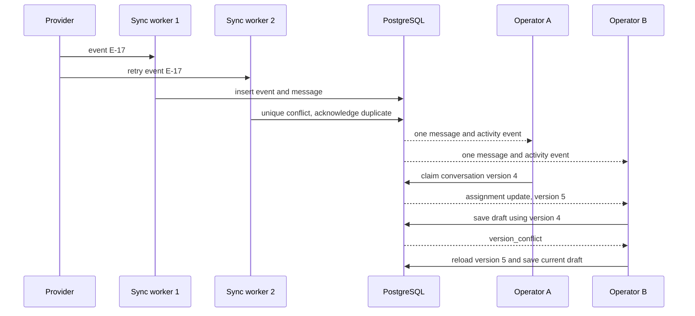
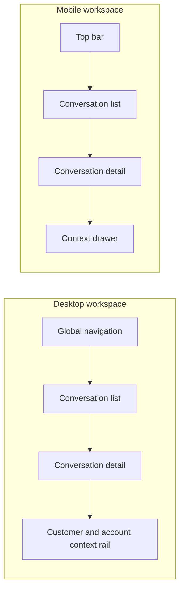

# AI Shared Inbox and Customer Operations Copilot

## Header

| Field | Value |
|---|---|
| Status | Greenfield |
| Author | OpenCode |
| Date | 2026-08-04 |
| Delivery window | 4 to 6 weeks |
| One-line pitch | Classifies, routes, drafts, and tracks shared customer conversations for operations teams. |
| Product source | `D:\ARC Automation Service\Project list.md`, Section 3 only |
| Existing codebase | None; target directory is empty |
| UI | Required |
| Verified stack boundary | Next.js, FastAPI, PostgreSQL, message queue, real-time updates, background sync |
| Verified integration boundary | Gmail, Microsoft Graph, Front, HubSpot, Salesforce, Slack, WhatsApp |
| Team, budget, external deadline | Not specified; no assumptions made |

### Source discipline

| Label | Meaning |
|---|---|
| Verified | Directly stated in the supplied project description or user inputs |
| `[inferred]` | A proposed implementation choice required to make the MVP buildable |
| `[uncertain]` | A provider capability, version, benchmark, or other fact not verified by the source |

## Project Summary

The product gives logistics companies, property managers, agencies, financial operations teams, wholesalers, travel companies, and customer-success teams one workspace for shared customer conversations. It classifies and prioritizes inbound requests, assigns ownership, summarizes context, extracts orders or shipment details, drafts a response, detects collisions, and tracks SLA state. The paid problem is duplicate replies, missed requests, unclear ownership, inconsistent answers, and broken SLAs.

The MVP is a human-controlled operations workspace. AI can classify, extract, retrieve, summarize, route, score confidence, and draft, but outbound communication requires explicit approval. The canonical demo is a freight customer reporting a delayed shipment: identify the shipment, obtain available tracking context, draft an accurate response, assign the account manager, and start an escalation timer. One seeded freight-like workspace and one validated live connector are `[inferred]` delivery choices.

## Table of Contents

| Section | Anchor |
|---|---|
| Header | [Header](#header) |
| Project Summary | [Project Summary](#project-summary) |
| Table of Contents | [Table of Contents](#table-of-contents) |
| Product Overview | [Product Overview](#product-overview) |
| Technology Stack | [Technology Stack](#technology-stack) |
| System Architecture | [System Architecture](#system-architecture) |
| Core Design: Shared Conversation Operations | [Core Design](#core-design-shared-conversation-operations) |
| Design System | [Design System](#design-system) |
| Build Plan | [Build Plan](#build-plan) |
| Open Decisions & Future Scope | [Open Decisions](#open-decisions--future-scope) |
| Appendix: References | [References](#appendix-references) |

## Product Overview

### Customer operations failure modes

> Shared mailboxes often produce duplicate replies, missed requests, unclear ownership, inconsistent answers, and broken SLAs.

- Duplicate replies happen when multiple operators work the same customer thread without a visible claim or collision state.
- Missed requests happen when inbound conversations are not classified, prioritized, assigned, or surfaced with an SLA timer.
- Unclear ownership happens when routing rules and assignment history are not visible to the whole operations workspace.
- Inconsistent answers happen when the operator lacks account history, extracted request data, tracking context, or evidence for a draft.
- Broken SLAs happen when timers do not start, pause, escalate, or stop with explicit recorded state.

### Buyers and operating context

| Source-specific context | Product implication |
|---|---|
| Logistics, property managers, agencies, financial operations, wholesalers, travel companies, customer-success teams | Optimize for shared operational queues, ownership, account context, and SLA visibility |
| Industries also listed: ecommerce, finance, real estate, B2B services | Keep channel and rule models generic enough for these contexts without adding vertical workflows |
| Recurring revenue is described as seat-based support, workflow changes, analytics, and inbox monitoring | Build observable operational events and configurable rules; pricing and billing are out of scope |
| Source recommendation calls this more commercially credible than a standalone personal email assistant | Keep the unit of work as a team-owned conversation, not an individual mailbox |

### MVP capability map

| Capability | Build behavior |
|---|---|
| Shared inbox | Conversation list filtered by status, queue, owner, priority, SLA state, and channel |
| Ingestion | Background synchronization normalizes provider messages and events into conversations |
| Classification | Typed request type, priority, confidence, rationale, and evidence message IDs |
| Assignment | Ordered business rules suggest a queue and optional owner; operators can assign or reassign |
| Prioritization | `low`, `normal`, `high`, `urgent`, or `unknown` with confidence |
| Summarization | Thread issue, customer ask, known facts, missing facts, and next action |
| Extraction | Customer, account, order, shipment, tracking, promised date, and requested action fields |
| Retrieval | Bounded account history and connector records with source timestamps |
| Drafting | Editable response with recipient, body, evidence, missing evidence, confidence, and approval state |
| Approval | Exact draft version must be explicitly approved before send |
| Collaboration | Internal comments, activity timeline, assignment history, claim state, and collision detection |
| SLA | Policy selection, start, due, warning, pause/resume, breach, escalation, and resolution state |
| Analytics | Intake, routing, SLA, AI, collaboration, sync, and outbound event-derived views |

### Human control boundary

| AI or automation action | MVP rule |
|---|---|
| Classify, prioritize, extract, retrieve, summarize, route, score confidence | May run asynchronously and update the workspace |
| Generate a draft | Must include evidence and missing-evidence state |
| Edit a draft | Increments the draft version and invalidates prior approval |
| Approve a draft | Requires the operator to approve the exact current version |
| Send a customer message | Requires a separate explicit send action after approval; no background auto-send path |
| New inbound message after approval | Returns the current draft to `approval_required` `[inferred]` |

### Success metrics

The targets below are MVP acceptance targets `[inferred]`, not external benchmarks. The source does not provide benchmark data, model versions, or provider performance guarantees.

| ID | Metric | Definition | Target |
|---|---|---|---|
| M-01 | Ingestion freshness | Accepted provider events visible in the inbox within 60 seconds | >= 95% per connector sync window |
| M-02 | Route latency | Normalized message persistence to route suggestion ready | p95 <= 120 seconds |
| M-03 | Required-field extraction | Replay fixtures where required fields are exact or explicitly null with evidence | >= 90% |
| M-04 | Assignment coverage | Open conversations with an owner or explicit unassigned reason | 100% |
| M-05 | Collision protection | Stale writes rejected without overwriting newer state | 100% in concurrency tests |
| M-06 | Unapproved send prevention | Outbound sends without a matching current approval | 0 |
| M-07 | SLA correctness | Fixture timers matching expected start, due, pause, breach, and resolve events | 100% |
| M-08 | Sync replay recovery | Transient failures reaching success or visible quarantine after retry | >= 99% in failure tests |
| M-09 | Audit coverage | State-changing commands with an append-only activity event | 100% |
| M-10 | Operator-safe workflow behavior | In scripted walkthroughs, the operator finds current owner, evidence, SLA state, and approval state without hidden system state | Qualitative observable behavior: pass in every scripted trace |

M-10 is the only qualitative metric. All other metrics are numeric counts, percentages, latencies, or exact state-transition checks.

## Technology Stack

### Verified application stack

| Technology | Requirement-specific justification | MVP responsibility | Verification status |
|---|---|---|---|
| Next.js | A UI is required and the source explicitly lists Next.js | Responsive shared inbox, detail workspace, customer profile, rules, analytics, and connector status | Verified stack boundary |
| FastAPI | The source explicitly lists FastAPI | Authenticated reads/writes, validation, approval checks, query endpoints, and command APIs | Verified stack boundary |
| PostgreSQL | The source explicitly lists PostgreSQL | System of record for conversations, messages, assignments, drafts, SLA, rules, events, sync state, and metric facts | Verified stack boundary |
| Message queue | The source explicitly requires a message queue | Async synchronization, AI actions, SLA checks, notifications, retries, and outbound actions | Verified stack boundary |
| Real-time updates | The source explicitly requires real-time updates and the workspace needs collision visibility | Stream assignment, comment, AI, sync, and SLA events to open clients | Verified stack boundary |
| Background sync | The source explicitly requires background sync and lists multiple providers | Import, pagination, retry, cursor handling, reconciliation, and connector health | Verified stack boundary |

### Integration boundary

| Integration | MVP role | Required normalized behavior | Provider-specific status |
|---|---|---|---|
| Gmail | Email source and approved email action | Import thread/message; send only after approval | OAuth scopes, history, push events, and send semantics `[uncertain]` |
| Microsoft Graph | Email source and approved email action | Import thread/message; send only after approval | Mail permissions, subscriptions, pagination, and send semantics `[uncertain]` |
| Front | Shared inbox source | Import conversation, assignment, comments, and approved reply where supported | Exact API coverage and permissions `[uncertain]` |
| HubSpot | Customer/account context | Lookup customer/account and linked activity context | Object permissions, search limits, and write support `[uncertain]` |
| Salesforce | Customer/account context | Lookup customer/account and linked activity context | Object permissions, API limits, and write support `[uncertain]` |
| Slack | Internal escalation notification | Post a conversation link and SLA escalation status | Event, channel, and permission behavior `[uncertain]` |
| WhatsApp | Customer conversation channel | Normalize inbound messages and approved response where supported | Business account, template, window, and send behavior `[uncertain]` |

### Stack constraints

| Unknown | Implementation rule |
|---|---|
| Provider versions are not supplied | Select and pin versions during the connector spike `[uncertain]`; do not state a version in this PRD |
| AI model/provider is not supplied | Use typed outputs, confidence, evidence, and human approval; model choice remains `[uncertain]` |
| Queue and realtime product are not supplied | Implement behind application interfaces `[inferred]` and preserve persisted events as the recovery source |
| Provider capabilities differ | Validate one canonical live connector first; fixture adapters remain the deterministic test path `[inferred]` |
| No hosting, authentication, retention, or compliance context is supplied | Use a narrow workspace boundary `[inferred]`; validate customer-specific requirements before real data |

## System Architecture

### Proposed bounded contexts `[inferred]`



### Bounded-context responsibilities

| Context | Owns | Does not own |
|---|---|---|
| Presentation | List/detail rendering, filters, forms, realtime subscription, responsive state | Provider credentials, approval decisions, or authoritative conversation state |
| Conversation operations | Conversation versions, messages, assignments, comments, drafts, approvals, SLA instances, audit events | Provider-specific payload translation or model prompting |
| Conversation intelligence | Typed classification, extraction, retrieval context, summary, draft result, confidence, evidence | Unapproved sends or direct UI mutation |
| Integration | Provider authentication, normalization, cursors, provider requests, response translation | Cross-provider business rules |
| Async execution | Job identity, retries, quarantine, scheduling, idempotency | User-visible policy decisions without persisted events |

### Numbered request-to-response communication flow `[inferred]`

1. A connector adapter receives a provider event or background-sync result.
2. The sync worker maps it to `NormalizedInboundEvent` and checks the event idempotency key.
3. PostgreSQL atomically stores the event, message, conversation link, and processing job record.
4. The queue dispatches classification, extraction, routing, retrieval, summary, and draft jobs.
5. Workers persist each successful result with its input version, confidence, evidence IDs, and activity event.
6. The API reads the current conversation projection and returns the latest version to the Next.js workspace.
7. The realtime layer emits persisted activity events to authorized workspace or conversation topics.
8. The operator claims, assigns, comments, edits, approves, resolves, or sends through version-checked API commands.
9. The API persists each state-changing command and emits the corresponding activity event in the same transaction.
10. The outbound worker sends only an approved current draft, records the provider result, and exposes retry or failure state.
11. The SLA worker emits one idempotent escalation event when the due or breach condition is reached.

### Proposed directory tree `[inferred]`

```text
app/
  layout.tsx                    # Root Next.js shell and workspace providers
  page.tsx                      # Redirect or landing entry for the operations workspace
  inbox/
    page.tsx                    # Shared inbox list with queue filters
    [conversationId]/
      page.tsx                  # Conversation detail workspace
  customers/
    [customerId]/
      page.tsx                  # Customer profile and linked history
  rules/
    page.tsx                    # Assignment and SLA rule administration
  analytics/
    page.tsx                    # Event-derived operational analytics views
  settings/
    integrations/page.tsx       # Connector status, sync, retry, and setup UI
components/
  ConversationRow.tsx           # List row with owner, priority, collision, and SLA state
  ConversationDetail.tsx        # Thread, summary, draft, comments, and activity composition
  ContextRail.tsx                # Customer, account, CRM, order, shipment, and evidence context
  DraftComposer.tsx              # Editable draft and explicit approval/send controls
  SlaTimer.tsx                   # Running, warning, breached, paused, and resolved display
  StatusBadge.tsx                # Text-plus-color state presentation
  CollisionBanner.tsx            # Viewer, editor, and stale-write collision state
lib/
  apiClient.ts                  # Typed HTTP client for proposed API contracts
  realtimeClient.ts             # Authorized realtime subscription and sequence replay
  viewModels.ts                 # UI read-model types derived from API responses
api/app/
  main.py                       # FastAPI application entry point
  routers/conversations.py      # Conversation reads and state-changing commands
  routers/drafts.py             # Draft edit, approval, and send endpoints
  routers/rules.py              # Assignment and SLA rule endpoints
  routers/analytics.py          # Event-derived metric queries
  schemas/contracts.py          # Pydantic equivalents of shared typed contracts
  services/conversations.py     # Conversation version and assignment service
  services/approvals.py         # Exact-version human approval service
  services/sla.py               # SLA state and escalation service
  integrations/base.py          # Connector adapter interface
  integrations/providers.py     # Gmail, Graph, Front, CRM, Slack, and WhatsApp adapters
workers/
  queue.py                      # Message queue setup and job envelope handling
  sync.py                       # Cursor, backfill, retry, and normalization jobs
  intelligence.py               # Classification, extraction, retrieval, summary, and draft jobs
  outbound.py                  # Approved outbound action worker with idempotency
  sla.py                       # Due, warning, breach, and escalation scheduling
db/
  migrations/                   # Forward schema migrations
  seed_freight_demo.sql         # Deterministic freight-delay fixture workspace
tests/
  contracts/                    # Inbound, outbound, error, and realtime contract tests
  traces/                       # Freight delay and collision end-to-end fixtures
  concurrency/                  # Duplicate event and stale version tests
```

### Reliability and data boundaries `[inferred]`

| Concern | Rule |
|---|---|
| Workspace isolation | Every read and command carries an authenticated workspace scope |
| Authorization | Read, assignment, rule editing, approval, connector administration, and send permissions are checked server-side |
| Idempotency | Inbound events, command request IDs, escalations, and sends use uniqueness or idempotency keys |
| Transactions | Ingest, assign, approve, resolve, escalate, and send persist state plus activity atomically |
| Retry | Transient failures retry; terminal failures are quarantined with operator-visible reason |
| Secrets | Provider tokens are encrypted and excluded from UI read models and ordinary logs |
| Privacy | Raw payloads are protected; message bodies and authorization headers are redacted from normal logs |
| Degradation | The inbox remains readable when AI or realtime is unavailable; stale state is labeled |
| Recovery | A sync or AI action can be rerun without duplicate messages or sends |
| Provider unknowns | OAuth scopes, rate limits, history depth, webhook semantics, retention, and compliance are `[uncertain]` |

## Core Design: Shared Conversation Operations

### Operating state





### Conversation and AI pipeline



Each step is asynchronous but visible in the UI. A failed downstream step must not erase a successful upstream result `[inferred]`. Below-threshold confidence produces a review state rather than silent routing.

### Typed interfaces

```typescript
type RequestType =
  | "shipment_delay"
  | "order_status"
  | "order_change"
  | "billing"
  | "account_request"
  | "general_question"
  | "complaint"
  | "other"
  | "unknown";

type Priority = "low" | "normal" | "high" | "urgent" | "unknown";

type NormalizedInboundEvent = {
  eventId: string;
  connector: "gmail" | "microsoft_graph" | "front" | "whatsapp";
  workspaceId: string;
  providerAccountId: string;
  providerThreadId: string;
  providerMessageId: string;
  occurredAt: string;
  receivedAt: string;
  direction: "inbound" | "outbound";
  sender: { externalId: string | null; name: string | null; address: string | null };
  recipients: Array<{ name: string | null; address: string | null }>;
  subject: string | null;
  bodyText: string;
  bodyHtml: string | null;
  attachments: Array<{ providerId: string; name: string; contentType: string; sizeBytes: number }>;
  rawReference: string;
};

type Classification = {
  requestType: RequestType;
  priority: Priority;
  confidence: number;
  rationale: string;
  evidenceMessageIds: string[];
  createdAt: string;
};

type ExtractedEntities = {
  customerName: string | null;
  customerExternalId: string | null;
  accountId: string | null;
  orderId: string | null;
  shipmentId: string | null;
  trackingNumber: string | null;
  requestedAction: string | null;
  promisedDate: string | null;
  confidence: number;
  evidenceMessageIds: string[];
  unresolvedFields: string[];
};
```

Absent values are `null`; the system must not infer an identifier from an unrelated account record. `confidence` is bounded from `0` through `1`; calibration is `[uncertain]`.

### Draft, event, and outbound contracts

```typescript
type EvidenceRef = {
  sourceType: "message" | "account_record" | "crm_record" | "tracking_result";
  sourceId: string;
  label: string;
  capturedAt: string;
};

type Draft = {
  id: string;
  conversationId: string;
  version: number;
  channel: "email" | "front" | "whatsapp";
  recipient: string;
  subject: string | null;
  body: string;
  evidence: EvidenceRef[];
  missingEvidence: string[];
  confidence: number;
  state: "generating" | "ready" | "edited" | "approval_required" | "approved" | "rejected" | "send_failed";
  generatedAt: string;
  updatedAt: string;
};

type ApprovedOutboundAction = {
  actionId: string;
  workspaceId: string;
  conversationId: string;
  draftId: string;
  draftVersion: number;
  connector: "gmail" | "microsoft_graph" | "front" | "whatsapp";
  approvedBy: string;
  approvedAt: string;
  idempotencyKey: string;
  state: "queued" | "sending" | "sent" | "failed";
};

type ActivityEvent = {
  id: string;
  workspaceId: string;
  conversationId: string | null;
  type: "message_imported" | "classified" | "entities_extracted" | "assigned" | "comment_added" | "summary_created" | "draft_created" | "draft_edited" | "draft_approved" | "outbound_sent" | "sla_started" | "sla_escalated" | "resolved" | "sync_failed";
  actor: { type: "user" | "ai" | "system"; id: string | null };
  payload: Record<string, unknown>;
  occurredAt: string;
  sequence: number;
};

type RealtimeEnvelope = {
  topic: `workspace:${string}` | `conversation:${string}`;
  sequence: number;
  event: ActivityEvent;
  emittedAt: string;
};
```

### HTTP and queue interfaces `[inferred]`

| Method | Path | Request | Response or rule |
|---|---|---|---|
| `GET` | `/api/v1/conversations` | Filters, cursor, limit | Conversation list and next cursor |
| `GET` | `/api/v1/conversations/{id}` | None | Detail read model and latest sequence |
| `POST` | `/api/v1/conversations/{id}/assign` | Owner/queue, expected version | Updated assignment and conversation version |
| `POST` | `/api/v1/conversations/{id}/claim` | Expected version | Updated collision and assignment state |
| `POST` | `/api/v1/conversations/{id}/comments` | Body, client request ID | Activity event |
| `POST` | `/api/v1/conversations/{id}/ai/run` | Action, input version | Job ID and action state |
| `PATCH` | `/api/v1/drafts/{id}` | Body, expected draft version | Updated draft |
| `POST` | `/api/v1/drafts/{id}/approve` | Expected draft version | Approval ID and state |
| `POST` | `/api/v1/drafts/{id}/send` | Approval ID, idempotency key | Outbound action |
| `POST` | `/api/v1/conversations/{id}/resolve` | Expected conversation version | Updated SLA and state |
| `GET` | `/api/v1/rules` | None | Ordered assignment and SLA rules |
| `PUT` | `/api/v1/rules/{id}` | Typed rule, expected version | Updated rule |
| `GET` | `/api/v1/analytics` | Time and dimensions | Metric series and dimensions |
| `POST` | `/api/v1/connectors/{id}/sync` | Sync kind | Job ID |
| `GET` | `/api/v1/connectors` | None | Sanitized connector status |

```typescript
type ApiError = {
  code: "validation_error" | "not_found" | "version_conflict" | "approval_required" | "evidence_required" | "connector_unavailable" | "rate_limited" | "internal_error";
  message: string;
  requestId: string;
  fields?: Record<string, string[]>;
  retryable: boolean;
};

type QueueJob = {
  jobId: string;
  kind: "sync" | "normalize" | "classify" | "extract" | "retrieve" | "summarize" | "draft" | "sla" | "notify" | "send";
  workspaceId: string;
  conversationId: string | null;
  inputVersion: number | null;
  idempotencyKey: string;
  attempt: number;
  createdAt: string;
};
```

### Operational rules

| ID | Rule | Acceptance condition |
|---|---|---|
| IN-01 | Normalize inbound events | A valid event creates or updates exactly one conversation and message set |
| IN-02 | Preserve provider identity | Source account, channel, thread, message, and event IDs are queryable |
| IN-03 | Deduplicate retries | Replaying an event creates no second message or activity event |
| CL-01 | Type the request | Result is an enum or `unknown`, never only a free-form label |
| CL-02 | Explain classification | Rationale and evidence message IDs are visible |
| RT-01 | Evaluate ordered rules | First matching enabled rule creates the route suggestion |
| RT-02 | Provide fallback | No match produces unassigned state and visible reason |
| RT-03 | Preserve assignment history | Actor, previous value, new value, and timestamp are recorded |
| RT-04 | Protect collisions | Stale edits fail and cannot overwrite a newer version |
| AI-01 | Summarize the thread | Issue, ask, facts, missing facts, and next action are present |
| AI-02 | Extract entities | Order, shipment, account, and request fields are typed and nullable |
| AI-03 | Bound retrieval | Context lists records used and their timestamps |
| AI-04 | Mark missing evidence | Missing shipment or account records remain unresolved, not fabricated |
| DR-01 | Generate an editable draft | Recipient, body, evidence, confidence, and state are present |
| DR-02 | Separate generation and approval | Generation never creates approval |
| DR-03 | Match approval version | Approval applies only to the exact displayed draft |
| DR-04 | Block unsupported claims | Missing required evidence is flagged or blocks approval |
| SLA-01 | Persist the timer | Policy, start, due, warning, pause, breach, and resolution are queryable |
| SLA-02 | Escalate once | A due or breached timer emits one idempotent escalation event |
| CO-01 | Keep comments internal | Internal comments are excluded from outbound drafts unless explicitly copied |
| CO-02 | Stream activity | Assignment, comment, AI, sync, and SLA events update open clients |
| CO-03 | Expose failure state | Failed sync, AI, and send actions have retry state and operator reason |

### Data model `[inferred]`

| Table | Key columns | Constraint |
|---|---|---|
| `workspace` | `id`, `name`, `created_at` | All tenant-scoped records reference workspace |
| `connector_account` | `id`, `workspace_id`, `connector`, `status`, `cursor` | Provider account unique per workspace and connector |
| `conversation` | `id`, `workspace_id`, `channel`, `status`, `priority`, `request_type`, `owner_id`, `queue_id`, `version` | Version increments on user-visible mutation |
| `message` | `id`, `conversation_id`, `provider_message_id`, `direction`, `body_text`, `occurred_at` | Provider message identity unique per account |
| `customer` | `id`, `workspace_id`, `external_ids`, `name`, `primary_address` | External identity may be unresolved |
| `classification` | `conversation_id`, `version`, `request_type`, `priority`, `confidence`, `evidence_ids` | History is retained; latest is explicit |
| `extracted_entity_set` | `conversation_id`, `version`, `payload`, `evidence_ids`, `confidence` | Latest version is explicit |
| `assignment_rule` | `id`, `workspace_id`, `priority`, `conditions`, `target`, `enabled` | Evaluation order is deterministic |
| `assignment` | `conversation_id`, `owner_id`, `queue_id`, `source`, `created_at` | Current assignment is queryable |
| `sla_policy` | `id`, `workspace_id`, `conditions`, `target_seconds`, `warning_seconds` | One active policy per conversation |
| `sla_instance` | `conversation_id`, `policy_id`, `started_at`, `due_at`, `state` | Breach emission is idempotent |
| `draft` | `id`, `conversation_id`, `version`, `body`, `evidence`, `state` | Approval references exact version |
| `approval` | `id`, `draft_id`, `draft_version`, `approved_by`, `approved_at` | Invalidated by version or thread change |
| `activity_event` | `id`, `workspace_id`, `conversation_id`, `type`, `actor`, `payload`, `occurred_at` | Append-only event record |
| `sync_job` | `id`, `connector_account_id`, `kind`, `state`, `attempts`, `error` | Retry and quarantine state visible |

### Trace 1: freight delay input to approved response

The input below is the source-specific freight-delay demo, represented as a deterministic fixture `[inferred]`.

```typescript
type FreightDelayInput = {
  channel: "email";
  subject: string;
  body: string;
  sender: { name: string; address: string };
  shipmentId: string;
  trackingNumber: string;
};

const input: FreightDelayInput = {
  channel: "email",
  subject: "Shipment FT-204 is delayed",
  body: "Our freight shipment FT-204 has not arrived. Please confirm the new delivery date.",
  sender: { name: "Jordan Lee", address: "jordan@example.test" },
  shipmentId: "FT-204",
  trackingNumber: "TRK-204"
};
```



```typescript
type FreightDelayOutput = {
  requestType: "shipment_delay";
  priority: "high" | "urgent";
  shipmentId: string;
  trackingNumber: string;
  queue: string;
  owner: string | null;
  draftState: "approval_required" | "approved";
  evidence: EvidenceRef[];
  slaState: "running" | "warning" | "breached" | "resolved";
  auditEventTypes: string[];
};
```

Required result: the system identifies the shipment, uses available tracking context, assigns or visibly falls back to unassigned, drafts only evidenced facts, requires explicit approval, and starts one escalation timer. No automated outbound send is allowed.

### Trace 2: duplicate event to collision-safe recovery

```typescript
type DuplicateCollisionInput = {
  providerEventId: string;
  providerMessageId: string;
  retryCount: number;
  operatorA: { id: string; action: "claim" };
  operatorB: { id: string; action: "edit_stale_draft" };
};

const input: DuplicateCollisionInput = {
  providerEventId: "E-17",
  providerMessageId: "M-17",
  retryCount: 1,
  operatorA: { id: "operator-a", action: "claim" },
  operatorB: { id: "operator-b", action: "edit_stale_draft" }
};
```



```typescript
type DuplicateCollisionOutput = {
  messageCount: 1;
  activityCount: 1;
  assignmentVersion: 5;
  staleWrite: { code: "version_conflict"; overwritten: false };
  recovery: "reload_current_version_and_edit";
};
```

Required result: a retry creates no duplicate message, conversation, or notification; both clients receive the assignment update; the stale write is rejected; the operator can reload and continue.

### Trace 3: low-confidence request with missing account match

1. A normalized message arrives without a stable customer identifier.
2. Classification returns `unknown` or a below-threshold confidence value.
3. Routing falls back to the unassigned queue and records the reason.
4. Extraction shows null account and shipment fields instead of guessed values.
5. Draft generation waits for review or shows missing evidence.
6. The operator links the account, edits the draft, and approves the new version.

## Design System

### Design principles

| Principle | Interface rule |
|---|---|
| Operational clarity | Owner, queue, priority, SLA state, collision state, and next action are visible in list and detail contexts |
| Human control | AI actions show state and evidence; approval and send are separate explicit controls |
| Evidence before assertion | Draft facts link to messages, account records, CRM records, or tracking results |
| Dense triage, calm detail | Compact conversation rows; generous thread and context spacing |
| State is not color-only | Every state has text, icon or shape, and accessible name |
| One workspace | Thread, context, comments, AI actions, assignment, and SLA stay connected |

### CSS color tokens

```css
:root {
  --color-page: #f4f1eb; /* intent: warm neutral operations canvas */
  --color-surface: #ffffff; /* intent: readable work panels */
  --color-navigation: #17212b; /* intent: stable global navigation contrast */
  --color-text: #182027; /* intent: primary operational content */
  --color-muted: #66717a; /* intent: secondary timestamps and metadata */
  --color-active: #2864d7; /* intent: current workflow selection */
  --color-attention: #b87508; /* intent: SLA warning and review needed */
  --color-danger: #b33a35; /* intent: breach, error, and blocked action */
  --color-success: #26734a; /* intent: confirmed completion only */
  --color-divider: #d9d5ce; /* intent: panel and row separation */
  --color-focus: #7c5cff; /* intent: visible keyboard focus ring */
}
```

### Typography scale

| Token | Size/line | Use |
|---|---|---|
| `--type-xs` | 12px / 16px | Provider metadata, timestamps, compact labels |
| `--type-sm` | 14px / 20px | List rows, secondary fields, controls |
| `--type-md` | 16px / 24px | Message body and default interface text |
| `--type-lg` | 20px / 28px | Detail section titles and SLA emphasis |
| `--type-xl` | 28px / 36px | Page title and major analytics value |
| `--type-display` | 36px / 44px | Demo-level workspace heading `[inferred]` |

Use one readable sans-serif family with tabular numerals for timers and metrics `[inferred]`. Keep list rows compact and the detail thread vertically generous.

### Layout diagram `[inferred]`



### Routes and components `[inferred]`

| Route | Purpose | Primary action |
|---|---|---|
| `/inbox` | Shared conversation queue | Open, assign, prioritize, or bulk triage |
| `/inbox/:conversationId` | Conversation detail | Comment, edit, approve, send, or resolve |
| `/customers/:customerId` | Customer profile | Inspect account history and linked conversations |
| `/rules` | Assignment and SLA rules | Add, edit, enable, or disable typed rules |
| `/analytics` | Operational performance | Filter event-derived metrics |
| `/settings/integrations` | Connector administration | Connect, sync, pause, retry, or inspect errors |

| Component | Required states |
|---|---|
| Conversation row | Unread, assigned, unassigned, high priority, warning, breach, collision, sync error |
| Assignment control | Suggested owner, assigned owner, unassigned, reassignment pending |
| Confidence indicator | High, medium, low, unavailable; opens rationale and evidence |
| SLA timer | Running, paused, warning, breached, resolved |
| AI action card | Pending, completed, needs review, failed |
| Draft composer | Empty, generating, ready, edited, approval required, approved, send failed |
| Context rail | Customer, account, linked order/shipment, CRM records, source references |
| Activity timeline | Human, AI, integration, system, and failure events |
| Collision banner | No collision, viewing, editing, stale conflict |

### Micro-interactions

| Trigger | Interaction | Required result |
|---|---|---|
| New event | List row enters with a short non-blocking transition | New state is visible without shifting the focused control `[inferred]` |
| Accept assignment | Owner badge updates immediately | Activity event and realtime update are emitted |
| Claim | Claim control changes to current owner | Collision state updates for all connected clients |
| Edit draft | Save increments version | Evidence remains visible and no send occurs |
| Approve | Approval control confirms current version | Send control unlocks only for that version |
| New inbound after approval | Draft status changes to review | Previous approval is invalidated `[inferred]` |
| SLA warning | Timer changes to amber and exposes due time | No distracting animation for urgent states |
| SLA breach | Timer changes to red and activity appears | One escalation event is emitted |
| Connector failure | Persistent error state appears | Retry action and reason remain visible |
| Realtime reconnect | Show stale/reconnecting status | Replay from sequence or request full refresh `[inferred]` |

### Accessibility and responsive acceptance

| Check | Requirement |
|---|---|
| Keyboard | Triage, assignment, comments, draft, approval, send, resolve, and filters are keyboard reachable |
| Focus | Focus remains on the invoking control after non-destructive updates |
| Status | Text accompanies color; timers and states have accessible names |
| Screen reader | Conversation identity, owner, priority, and SLA state are announced |
| Mobile | At 390px CSS width, list/detail/context transitions work without horizontal scrolling `[inferred]` |
| Loading | Skeletons preserve layout and never appear as an empty inbox |

## Build Plan

The plan fits the source-stated 4 to 6 week window. Phase timing is `[inferred]` and does not assume a team size, budget, or external deadline.

### Phase 1: Thin-slice foundation (Week 1)

- [ ] Create the Next.js workspace shell and responsive inbox/detail route structure.
- [ ] Create PostgreSQL migrations for workspace, connector, conversation, message, and activity records.
- [ ] Implement deterministic normalized fixture events and the freight-delay seed workspace.
- [ ] Render conversation list, detail, source metadata, latest message, and activity timeline.
- [ ] Add contract tests for provider event identity and message identity.

Demoable output: a seeded freight-delay conversation appears in the workspace with stable IDs, source metadata, and a visible activity timeline.

### Phase 2: Triage and ownership (Week 2)

- [ ] Implement typed request type, priority, confidence, rationale, and evidence output.
- [ ] Implement ordered assignment rules, queue fallback, owner assignment, and assignment history.
- [ ] Implement claim state, active viewer/editor state, expected-version writes, and stale-write rejection.
- [ ] Add realtime assignment, comment, and activity updates to two open clients.
- [ ] Add classification, routing, and concurrency fixture tests.

Demoable output: two operators can open the same conversation, claim it, see the live update, and receive `version_conflict` on a stale edit.

### Phase 3: Context and safe drafting (Week 3)

- [ ] Implement typed entity extraction with nullable fields and evidence message IDs.
- [ ] Implement customer/account link state and bounded context retrieval.
- [ ] Implement thread summary with issue, ask, known facts, missing facts, and next action.
- [ ] Implement editable draft versions, evidence references, missing-evidence state, and approval.
- [ ] Ensure no outbound action exists without an exact current approval.

Demoable output: the freight-delay input produces a reviewable draft with shipment/account context, evidence, and no automatic send.

### Phase 4: Sync, SLA, and connector spike (Week 4)

- [ ] Validate one live connector path from the listed integration boundary `[inferred]`.
- [ ] Implement background sync, cursor or watermark state, retry, quarantine, and sync status.
- [ ] Implement SLA policy selection, timer start, warning, pause/resume, breach, and resolution.
- [ ] Implement one idempotent Slack escalation notification where the connector spike validates support `[inferred]`.
- [ ] Add normalized inbound and approved outbound adapter contract tests.

Demoable output: a validated live inbound message syncs, routes, starts an SLA timer, produces an approved draft, and exposes send or connector failure state.

### Phase 5: Analytics and hardening (Week 5)

- [ ] Build intake, routing, SLA, AI, collaboration, sync, and outbound analytics views.
- [ ] Instrument M-01 through M-10 from persisted events and expose time windows.
- [ ] Add retry/quarantine UI, audit completeness checks, and error correlation IDs.
- [ ] Complete responsive polish, keyboard flow, accessible state labels, and loading states.
- [ ] Run the freight-delay and duplicate/collision traces against deterministic fixtures.

Demoable output: operators review event-derived operational metrics, retry a failed job, inspect the full activity trail, and complete the core traces on desktop and mobile.

### Phase 6: Integration expansion or cut (Week 6, only if needed)

- [ ] Validate additional listed connector adapters against the same normalized contracts.
- [ ] Mark unsupported provider operations `[uncertain]` rather than presenting them as working.
- [ ] Polish the strongest validated connector and remove unvalidated claims from the demo.
- [ ] Re-run safety, idempotency, realtime reconnect, and approval-version tests.

Demoable output: a connector matrix shows working, blocked, and unknown capabilities without masking gaps; if expansion is not ready, the strongest validated path is stable.

### Scope gates

| Trigger | Cut decision |
|---|---|
| Provider capability blocks the canonical path | Keep the fixture-based demo and label the provider gap `[uncertain]` |
| Draft safety is not reliable | Keep human review, show missing evidence, and reduce supported request types |
| Connector expansion threatens core traces | Ship one validated connector and defer the rest |
| Week 5 is reached | Week 6 is stabilization or validated integration work, not a new product category |

## Open Decisions & Future Scope

### Open decisions

| Decision | Recommendation | Reason | Status |
|---|---|---|---|
| First live connector | Validate one email or shared-inbox connector through the canonical trace `[inferred]` | Provider read/write, webhook, scope, rate, and history behavior are `[uncertain]` | Decide during Week 4 spike |
| AI provider and version | Select a provider only after typed-output and evidence tests pass `[inferred]` | The source defines AI functions but no model or version | `[uncertain]` |
| Queue and realtime implementation | Hide both behind application interfaces and persist activity events `[inferred]` | The source names capabilities, not products or versions | `[inferred]` implementation choice |
| Routing defaults | Seed freight-delay rules but make queue, owner, priority, and SLA conditions editable `[inferred]` | Buyer-specific business rules are unspecified | MVP default |
| Account matching | Keep customer, order, shipment, and CRM matches nullable until evidence confirms them | Historical data shape and matching keys are unspecified | MVP rule |
| Workspace authorization | Use narrow server-side workspace scoping `[inferred]` | Existing authentication and tenancy context is absent | Validate before real data |
| Retention and compliance | Validate customer-specific policy before production data | Retention, regional storage, and compliance requirements are unspecified `[uncertain]` | Not a demo blocker |
| Provider send behavior | Expose send only for a validated adapter and approved draft | Listed providers may not support identical write paths `[uncertain]` | Connector-gated |

### Aggressive out-of-scope list

- Autonomous outbound sending: deferred because the source requires human approval and the MVP must prove approval safety first.
- Full omnichannel parity: deferred because the source lists seven integrations but does not verify equal capabilities or permissions.
- Voice, video, or phone workflows: deferred because they are not part of the shared-inbox description.
- Payments, scheduling, or order modification: deferred because they are not required by the freight-delay trace.
- Custom workflow builder: deferred because typed ordered routing and SLA rules cover the MVP with less implementation risk.
- Customer-facing portal: deferred because the source requires an operations workspace, not a portal.
- Fine-grained enterprise tenancy, billing, and seat plans: deferred because team and commercial requirements are unspecified.
- Multi-language generation: deferred because language requirements are unspecified.
- Sentiment, emotion, and personality scoring: deferred because they do not resolve the stated ownership, consistency, or SLA failures.
- Production certification for every listed connector: deferred because provider capabilities, versions, scopes, and limits are `[uncertain]` and the delivery window is 4 to 6 weeks.
- Model performance guarantees: deferred because no benchmark, provider, model version, or evaluation dataset is supplied.

## Appendix: References

### Source references

| Source location | Specific takeaway used |
|---|---|
| `D:\ARC Automation Service\Project list.md`, Section 3, lines 89-91 | Product name, advanced build classification, and 4 to 6 week build time |
| Same source, lines 93-97 | Buyer contexts and the duplicate, missed, ownership, consistency, and SLA problem |
| Same source, lines 99-101 | Required features and AI boundary: classification, extraction, retrieval, drafting, confidence, and human approval |
| Same source, lines 103-105 | Required stack and integration boundary |
| Same source, lines 107-109 | Premium operations workspace and agency-quality bar: account history, collision prevention, routing, approved actions, and performance tracking |
| Same source, lines 111-113 | Portfolio surfaces and freight-delay demo behavior |
| Same source, lines 115-127 | Industries, recurring revenue context, comparable category, and recommendation; commercial details do not expand MVP scope |

### Source boundary reminder

No external source, provider version, model benchmark, team assumption, budget assumption, or external deadline is used as a verified product fact. Provider capabilities and implementation structure are explicitly labeled `[uncertain]` or `[inferred]` where required.
