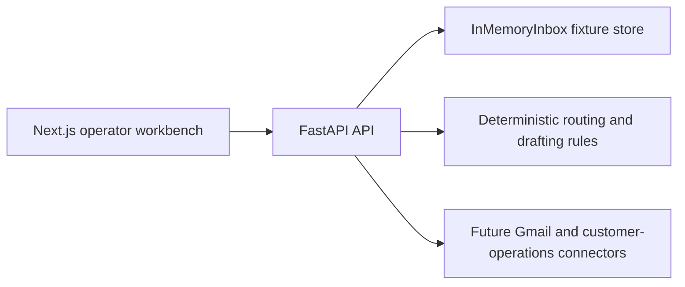

# AI Shared Inbox Customer Operations Copilot

Shared inbox workbench for triage, routing, collaboration, context, deterministic drafting, approval, and operator-controlled customer follow-up.

## Project status

This repository contains the verified fixture-first Phase 1-5 demo slice. It exposes a FastAPI API and a Next.js operator workbench for the seeded freight-delay conversation. It does not claim live AI, provider OAuth, PostgreSQL/Supabase persistence, queue/realtime transport, authentication, or durable audit support.

## Architecture



## Included capabilities

- Conversation list/detail and freight-delay fixture ingestion.
- Deterministic classification, extraction, context, summary, and drafting.
- Workspace-scoped assignment, claim, comments, activity replay, and rules.
- Version-checked draft editing, approval, and send gating.
- Stale-write protection with explicit `409` conflict responses.
- Responsive `/inbox` workbench with API and browser acceptance coverage.

## Quick start

Prerequisites: Python 3.11+, [`uv`](https://docs.astral.sh/uv/), Node.js/npm, and PowerShell.

```powershell
npm --prefix apps/web ci
.\start-dev.ps1
```

The launcher starts the API at `http://127.0.0.1:8103` and the workbench at `http://127.0.0.1:3103/inbox`.

For direct API execution:

```powershell
uv run --with-requirements requirements.txt python -m uvicorn app.main:app --host 127.0.0.1 --port 8103
```

## Verification

```powershell
uv run --with-requirements requirements-dev.txt pytest -p no:cacheprovider -q
uv run --with-requirements requirements-dev.txt ruff check --no-cache app tests
npm --prefix apps/web run build
```

Check the fixture boundary:

```powershell
Invoke-RestMethod http://127.0.0.1:8103/healthz
Invoke-RestMethod http://127.0.0.1:8103/readyz
Invoke-RestMethod http://127.0.0.1:8103/api/v1/demo/reset -Method Post
```

## Project structure

```text
app/             FastAPI routes, fixture store, ingestion, and workflow services
apps/web/         Next.js operator workbench
fixtures/         Freight-delay fixture data
tests/             API, operations, drafting, ingestion, and acceptance tests
db/               Migration and seed artifacts for the persistence boundary
```

## Fixture endpoints

- `GET /healthz` - process liveness.
- `GET /readyz` - fixture dependency readiness.
- `POST /api/v1/demo/reset` - reset the disposable in-memory fixture.
- `GET /api/v1/conversations` - seeded inbox list.
- `POST /api/v1/conversations/{id}/ai/run` - deterministic classification/routing.
- `POST /api/v1/drafts/{id}/approve` - approve the current draft version.
- `POST /api/v1/drafts/{id}/send` - fixture-only send after approval.

Commands carry workspace, actor, and expected-version fields where applicable. A stale write returns `409` and does not overwrite current state.

## Production boundary

Before live use, replace client-supplied identity and workspace fields with authenticated claims, add durable repositories and migrations, connector OAuth/webhook verification, asynchronous sync jobs, idempotency, queue recovery, audit retention, data deletion, observability, backups, and authorization tests. The in-memory reset is disposable fixture behavior only.
